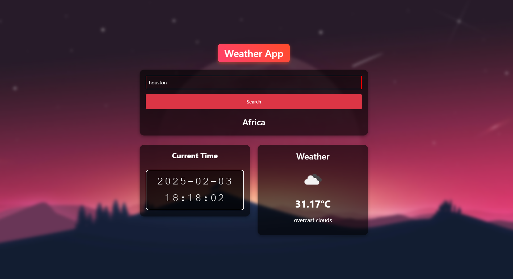

# 🌤️ Weather App - Django

A simple Weather App built with **Django** that fetches real-time weather data using the **OpenWeatherMap API**. Enter any city to get the current weather, temperature, and local time.

---

## 🚀 Features

- **Real-time Weather**: Displays temperature, weather description, and icon.
- **City-Based**: Enter any city to get weather information.
- **Local Time**: Shows the current time for the selected city.
- **Responsive**: Designed with **Bootstrap** for mobile and desktop.

---

## 📸 Screenshot



---

## 🔧 Setup

1. Clone the repository:
   ```bash
   git clone https://github.com/cyril1010/WeatherApp-Django.git
   ```

2. Install dependencies:
   ```bash
   pip install -r requirements.txt
   ```

3. Set up `.env` for the **API key**:
   ```
   OPENWEATHER_API_KEY=your-api-key-here
   ```

4. Run the development server:
   ```bash
   python manage.py runserver
   ```

---

## 📜 License

MIT License

---

## 👨‍💻 Author

**Cyril**  
[GitHub](https://github.com/cyril1010) | [LinkedIn](https://www.linkedin.com/in/cyril-k-u/)
